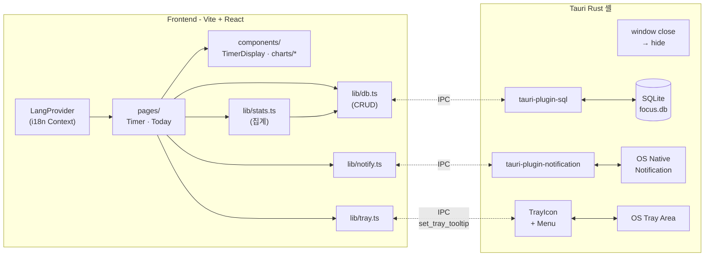

# 개발자용 포커스 타이머

> 60분 비주얼 다이얼 타이머 + 집중 패턴 분석 도구. 모든 데이터는 로컬 SQLite에 저장되며 서버로 전송되지 않습니다.

업무/공부 두 모드, 태그가 있는 집중 세션, 자기평가, 인터럽트 사유 기록까지 한 곳에서 관리합니다.

---

## 주요 기능

### 타이머
- 업무 모드 / 공부 모드 분리 — 모드마다 다른 태그셋
- 태그 기반 세션 (현재 모드 13개 태그 시드)
- 5/10/20/30/40/50/60분 프리셋
- 60분 비주얼 다이얼 — 6가지 컬러 테마 (`moran`, `sunfish`, `pepe`, `rocky`, `pointNemo`, `burjKhalifa`)
- 세션 완료 시 자기평가 (집중 잘됨 / 흐트러짐)
- 세션 중단 시 사유 선택 — 모드별 사유셋
- OS 네이티브 알림 + 비프음(1회/3회 선택) + 다이얼 깜빡임 옵션

### 오늘 대시보드
- 총 집중시간 / 완료 세션 수 / 베스트 스트릭 KPI
- 모드별 필터 (전체 / 업무 / 공부)
- 태그별 분포 도넛 차트
- 시간순 타임라인 (인터럽트 세션은 빨간 점선으로 구분)
- 인터럽트 사유별 막대 차트

### 사용자 정의 "오늘"
- 설정에서 **하루 시작 시각**을 0~23시로 변경 가능
- 예: `5시`로 설정하면 새벽 1시에 한 세션도 자동으로 전날에 묶임

### 마지막 사용 상태 기억
- 모드, 태그(모드별로 따로), 시간 프리셋을 영속화 → 앱 재시작 후에도 같은 조합으로 시작
- 세션 종료 후에도 직전 선택이 그대로 유지됨 (이전에는 첫 번째 태그로 리셋되던 동작 수정)
- 저장 키: `focus-timer.lastModeKey`, `focus-timer.lastTagKey.<modeKey>`, `focus-timer.lastPlannedMin`

### 시스템 트레이 + 백그라운드 유지
- 작업 표시줄 트레이 아이콘 — **좌클릭** 창 토글, **우클릭** `Show / Hide / Quit` 메뉴
- **창 X 버튼**을 눌러도 종료 안 됨 → 트레이로 숨고 타이머는 백그라운드에서 계속 작동
- 트레이 호버 시 툴팁에 남은 시간 표시 (예: `25분 남음 · 코딩 공부` / `25m left · Coding Practice`)
- IPC 비용 최소화를 위해 분 단위로만 툴팁 갱신

### 미니 모드
- **헤더 우측 끝의 미니 모드 버튼**으로 즉시 진입 (또는 설정 → 미니 모드 켜기)
- 창이 360×520으로 줄어 현재 모니터의 **오른쪽 위 코너에 고정** + **항상 위에 표시**
- **실행 전**: 모드 토글 + 태그 칩 + 시간 프리셋을 컴팩트하게 보여줌 → 풀 모드로 돌아가지 않고도 다음 세션 세팅 가능 (다이얼은 200px로 축소)
- **실행 중**: 다이얼(320px) + 완료/중단 버튼만 표시, 미니 헤더 좌측에 **현재 태그**(예: `버그픽스`, `독서/논문`) 표시
- 우상단 ↗ 아이콘으로 즉시 풀 모드(640×720, 화면 가운데) 복귀
- 설정에서 켤 때는 설정 모달이 자동으로 닫힘 (미니 창 폭보다 모달이 넓어서)
- 상태는 `focus-timer.miniMode` localStorage 키에 저장 → 재시작 후 유지

### 다국어 (한국어 / English)
- 설정 모달에서 즉시 전환 — 페이지 새로고침 없이 모든 화면 갱신
- 모드/태그/인터럽트 사유 라벨도 영어로 매핑됨
- 시간 포맷도 언어별 분기 (`1시간 23분` ↔ `1h 23m`)
- 트레이 우클릭 메뉴는 OS 표준 톤에 맞춰 영어 고정

---

## 기술 스택

| 레이어 | 사용 |
|---|---|
| 프론트엔드 | Vite + React 19 + TypeScript |
| 데스크톱 셸 | Tauri 2.x (Rust) |
| DB | SQLite via `@tauri-apps/plugin-sql` |
| 스타일링 | Tailwind CSS 3 |
| 차트 | Recharts 3 |
| 알림 | `@tauri-apps/plugin-notification` |
| 트레이 | Tauri 2.x `tray-icon` feature |
| i18n | 자체 구현 (`lib/i18n.ts` + Context) |

---

## 시스템 아키텍처



### 핵심 설계 원칙

1. **세션 = 단일 레코드** — `sessions` 테이블 한 줄에 모든 정보를 저장. 조인 최소화로 INSERT/UPDATE 빠름.
2. **일시정지 없음** — 끊기면 인터럽트로 기록 (포모도로 철학).
3. **태그를 enum이 아닌 테이블로** — 모드별 다른 태그셋 + 향후 사용자 커스터마이즈 여지.
4. **집계는 클라이언트에서** — `getSessionsBetween(from, to)`로 한 번 받아서 `lib/stats.ts`가 가공. 로컬 앱이라 데이터량이 작아 SQL 집계 분산보다 단순함.
5. **모든 통계 함수가 기간(`fromIso`, `toIso`) 기반** — 오늘 대시보드와 향후 주/월 패턴 화면이 같은 함수를 재사용.
6. **i18n은 자체 구현** — `lib/i18n.ts`의 메시지 사전 + `LangProvider` Context. 외부 라이브러리 없이 번들 가벼움. DB 시드 라벨은 한국어로 보관하고 영어 모드일 때 `key`로 매핑.
7. **창 X 버튼 = 백그라운드 유지** — Rust `WindowEvent::CloseRequested`를 가로채 `hide()` 호출. `Quit` 메뉴를 통해서만 실제 종료.

---

## 데이터 모델

```sql
-- 모드: 업무 / 공부 (확장 가능)
CREATE TABLE modes (
  id    INTEGER PRIMARY KEY,
  key   TEXT NOT NULL UNIQUE,   -- 'work' | 'study'
  label TEXT NOT NULL
);

-- 태그: 모드별 다름
CREATE TABLE tags (
  id       INTEGER PRIMARY KEY,
  mode_id  INTEGER NOT NULL REFERENCES modes(id),
  key      TEXT NOT NULL,
  label    TEXT NOT NULL,
  color    TEXT,                       -- 차트 색상 (#hex)
  archived INTEGER NOT NULL DEFAULT 0,
  UNIQUE(mode_id, key)
);

-- 세션: 한 줄에 모든 정보
CREATE TABLE sessions (
  id               INTEGER PRIMARY KEY,
  mode_id          INTEGER NOT NULL REFERENCES modes(id),
  tag_id           INTEGER NOT NULL REFERENCES tags(id),
  planned_min      INTEGER NOT NULL,
  started_at       TEXT NOT NULL,                  -- ISO8601
  ended_at         TEXT,                           -- 완료/중단 시점
  status           TEXT NOT NULL,                  -- running | completed | interrupted
  interrupt_reason TEXT,
  self_review      TEXT,                           -- focused | distracted
  note             TEXT
);
```

### 모드별 시드 태그

| 모드 | 태그 |
|---|---|
| **업무 (work)** | 버그픽스 · API · 리팩토링 · 회의 · 배포 · 문서 |
| **공부 (study)** | 코딩 공부 · 독서/논문 · 튜토리얼 · 개인 프로젝트 · 복습 · 자격증 · 커리어 |

### 인터럽트 사유 (모드별)

| 업무 | 공부 |
|---|---|
| 급한 문의 / 회의 / 집중 안됨 / 배포·장애 / 기타 | 집중 안됨 / 급한 연락 / 업무 요청 / 기타 |

---

## 디렉토리 구조

```
focus-timer/
├── package.json
├── tailwind.config.js
├── vite.config.ts
├── index.html
│
├── src/                            # 프론트엔드
│   ├── App.tsx                     # 뷰 전환 + 전역 설정 영속화
│   ├── main.tsx
│   ├── index.css
│   ├── types.ts                    # Mode · Tag · Session · 인터럽트 사유
│   │
│   ├── pages/
│   │   ├── Timer.tsx               # 타이머 화면
│   │   └── Today.tsx               # 오늘 대시보드
│   │
│   ├── components/
│   │   ├── ModeToggle.tsx
│   │   ├── TagPicker.tsx
│   │   ├── TimerDisplay.tsx        # 60분 비주얼 다이얼 SVG
│   │   ├── InterruptModal.tsx
│   │   ├── ReviewModal.tsx
│   │   ├── SettingsModal.tsx
│   │   ├── ViewTabs.tsx            # 타이머 ↔ 오늘 탭
│   │   └── charts/
│   │       ├── KpiCard.tsx
│   │       ├── DonutChart.tsx
│   │       ├── Timeline.tsx
│   │       └── InterruptBar.tsx
│   │
│   └── lib/
│       ├── db.ts                   # tauri-plugin-sql 래퍼 + CRUD
│       ├── stats.ts                # 기간 기반 집계 함수
│       ├── notify.ts               # OS 알림
│       ├── sound.ts                # 비프음
│       ├── tray.ts                 # 시스템 트레이 IPC 헬퍼
│       ├── window.ts               # 미니 모드 / 창 크기·위치·always-on-top
│       ├── i18n.ts                 # 메시지 사전 (ko/en) + 라벨 매핑
│       ├── lang.tsx                # LangProvider + useLang hook
│       └── time.ts                 # 시간 포맷 헬퍼
│
└── src-tauri/                      # Tauri Rust 셸
    ├── tauri.conf.json
    ├── Cargo.toml
    └── src/
        ├── main.rs
        ├── lib.rs
        └── migrations.rs           # SQLite 마이그레이션 + 시드
```

---

## 시작하기

### 사전 조건 (Windows)

| 도구 | 설치 |
|---|---|
| **Node.js 20.x LTS+** | `winget install OpenJS.NodeJS.LTS` |
| **Rust toolchain** | `winget install Rustlang.Rustup` |
| **MSVC Build Tools** | `winget install Microsoft.VisualStudio.2022.BuildTools --override "--wait --add Microsoft.VisualStudio.Workload.VCTools --includeRecommended"` |
| **WebView2 Runtime** | Windows 11 기본 포함 |

설치 후 새 PowerShell을 열고 확인:

```powershell
node --version    # v20.x.x 이상
cargo --version
rustc --version
```

### 개발 모드 실행

```powershell
git clone https://github.com/ladybird17/focus-timer.git
cd focus-timer
npm install
npm run tauri dev
```

> 첫 실행 시 Rust 의존성 빌드로 5–15분 소요됩니다. 두 번째부터는 수십 초 안에 창이 뜹니다.

### 프로덕션 빌드

```powershell
npm run tauri build
```

결과물:
- Windows 인스톨러: `src-tauri/target/release/bundle/msi/*.msi`
- 단일 실행파일: `src-tauri/target/release/bundle/nsis/*.exe`

---

## 데이터 위치 / 백업

| OS | 경로 |
|---|---|
| Windows | `%APPDATA%\com.focus-timer.app\focus.db` |
| macOS | `~/Library/Application Support/com.focus-timer.app/focus.db` |

`focus.db` 한 파일을 복사하면 백업 완료입니다. 동기화 도구(OneDrive, Dropbox 등) 폴더에 심볼릭 링크를 걸어두는 것도 권장.

---

## 로드맵

| 단계 | 범위 | 상태 |
|---|---|---|
| **M1** | 타이머 (모드 토글 / 태그 / 시작·완료·중단 / 사유·자기평가 모달 / OS 알림 / 컬러 테마) | ✅ 완료 |
| **M2** | 오늘 대시보드 (KPI · 도넛 · 타임라인 · 인터럽트 막대) | ✅ 완료 |
| | 시스템 트레이 + 백그라운드 유지 | ✅ 완료 |
| | 다국어 (한국어 / English) | ✅ 완료 |
| | 미니 모드 (오른쪽 위 코너 고정 + 항상 위, 인라인 세션 세팅) | ✅ 완료 |
| | 마지막 사용 상태 기억 (모드 / 태그 / 시간) | ✅ 완료 |
| **M3** | 데일리/베스트 스트릭 KPI | ✅ 완료 |
| | 집중도 (focused/distracted) KPI 및 타임라인 노출 | ✅ 완료 |
| | 모드별 비교 (업무 vs 공부 시간/세션/집중도) | ✅ 완료 |
| **M4** | 주/월 패턴 (시간대×인터럽트 히트맵, 태그×자기평가 매트릭스) | ⬜ 미정 |
| | CSV / JSON 내보내기 | ⬜ 미정 |
| | 글로벌 단축키 (`Ctrl+Alt+Space`로 시작/중단) | ⬜ 선택 |

> M4는 데이터가 1~2주 누적된 후 의미가 생기므로, 우선순위를 그에 맞춰 조정합니다.

---

## 추천 IDE 설정

[VS Code](https://code.visualstudio.com/) + 확장:
- [Tauri](https://marketplace.visualstudio.com/items?itemName=tauri-apps.tauri-vscode)
- [rust-analyzer](https://marketplace.visualstudio.com/items?itemName=rust-lang.rust-analyzer)
- [Tailwind CSS IntelliSense](https://marketplace.visualstudio.com/items?itemName=bradlc.vscode-tailwindcss)

---

## 라이선스

MIT
